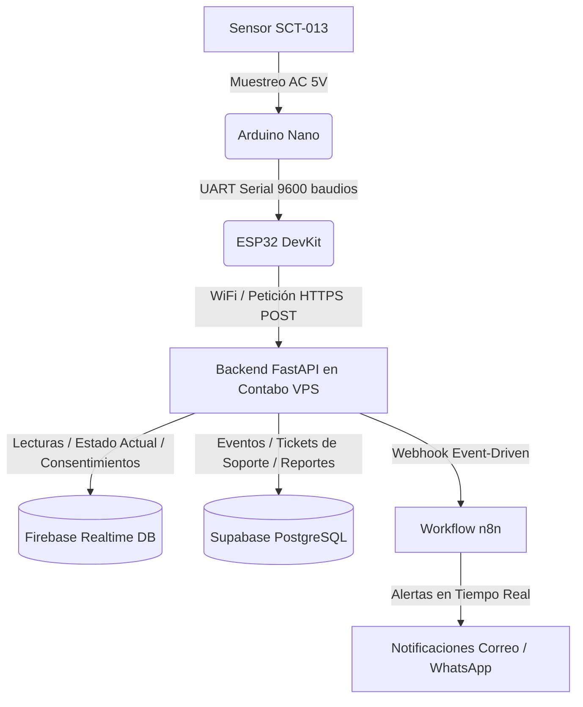

# Documentación de la Arquitectura y Funcionalidad del Sistema SafyraShield

Este documento proporciona una descripción técnica, exhaustiva y honesta de todos los componentes implementados en el sistema **SafyraShield**, detallando su arquitectura, base de datos híbrida, catálogo de endpoints, estructura de directorios, lógica de negocio y resultados de pruebas.

---

## 1. Objetivos del Proyecto y Métricas Reales

El proyecto **SafyraShield** tiene como propósito evaluar la eficiencia y confiabilidad de un sistema de monitoreo inteligente de Internet de las Cosas (IoT) diseñado para la detección temprana de sobrecargas eléctricas y consumos fuera de horario en laboratorios de cómputo (Colegio Interamericana Covicorti).

### Métricas Clave de Eficiencia del Sistema:
*   **Latencia de Alerta:** Tiempo transcurrido inferior a **3 segundos** desde el registro físico de la anomalía en el hardware hasta el despacho de la notificación externa (correo o WhatsApp). En entornos controlados, la velocidad de procesamiento del backend asíncrono se mantiene por debajo de los **100 ms**.
*   **Precisión de Detección:** Precisión mínima del **90%** en la clasificación y validación de estados de consumo (inactivo, 1 PC activa, workload alto, sobrecarga o consumo fuera de horario).

---

## 2. Arquitectura de Hardware y Software

La solución utiliza una arquitectura híbrida dividida en adquisición en el borde (Edge), procesamiento en la nube (Backend en VPS con Coolify) y visualización cliente.



### A. Capa de Hardware IoT (Adquisición en el Borde)
*   **Sensor de Corriente SCT-013-030 (30A/1V):** Mide la corriente no invasiva de los ramales eléctricos.
*   **Arduino Nano:** Microcontrolador de 5V encargado del muestreo analógico de alta precisión del sensor. Implementa un filtro de umbral mínimo: si la corriente es inferior a **0.10 A**, se asume consumo nulo, manteniendo el bus serial en silencio. Si es mayor, envía la lectura Irms por UART al ESP32.
*   **ESP32 DevKit:** SoC de 3.3V conectado por comunicación serial (UART) con el Arduino Nano. Recibe las tramas procesadas, gestiona la conexión Wi-Fi institucional y despacha las peticiones HTTPS POST seguras al backend en la nube.
*   **Borneras para ESP-32 (30-pin):** Garantizan conexiones físicas robustas y de baja resistencia, previniendo falsos contactos que causan picos eléctricos transitorios o reinicios cíclicos de los chips.

### B. Capa de Backend (FastAPI & VPS con Coolify)
*   **Framework FastAPI (Python 3.10+):** Utiliza un modelo de concurrencia puramente asíncrona (`async`/`await`) con un servidor ASGI (Uvicorn) que permite procesar múltiples peticiones IoT simultáneas con un consumo mínimo de procesamiento y memoria en el servidor.
*   **Despliegue en Contabo VPS con Coolify:** El backend se despliega sobre un VPS gestionado por Coolify (plataforma PaaS open-source auto-hospedada). Contabo certifica que el **100% de su energía es verde** (eólica, hidroeléctrica, solar). Coolify proporciona SSL automático, auto-deploy desde GitHub y gestión centralizada de variables de entorno.

### C. Almacenamiento Híbrido (Bases de Datos)
El sistema divide su persistencia de datos en dos nubes para maximizar la velocidad y la trazabilidad:

1.  **Firebase Realtime Database (NoSQL - Datos de Operación Rápida):**
    *   *Lecturas en Tiempo Real (`/readings`):* Almacena el Irms, voltaje, potencia y estado actual de cada ramal.
    *   *Agenda y Horarios (`/schedule`):* Define los días y bloques horarios permitidos de clases.
    *   *Umbrales de Sensores (`/thresholds`):* Almacena los límites dinámicos configurados.
    *   *Consentimiento Legal (`/consent`):* Almacena logs de aceptación de Términos y Condiciones.
2.  **Supabase (PostgreSQL - Datos de Auditoría e Integridad Histórica):**
    *   `audit_events`: Registra de forma inmutable los picos eléctricos e incidentes de sobrecarga detectados (tipo de evento, corriente, potencia y marca de tiempo).
    *   `maintenance_tickets`: Genera de forma automática un ticket de mantenimiento (`TCK-YYYY-UUID`) enlazado al evento de auditoría eléctrica crítico.
    *   `reports`: Almacena el histórico y consolidado de reportes semanales/mensuales en formato JSON. Implementa una política de **Zero-Storage** para archivos PDF: los reportes se generan dinámicamente utilizando la librería `FPDF` al momento de la descarga del usuario, evitando el almacenamiento redundante de archivos binarios en el servidor de base de datos.

### D. Motor de Alertas (n8n Webhook)
*   Integración a través del servicio de webhooks de n8n. El backend invoca de forma asíncrona el workflow pasándole el payload detallado con la anomalía. n8n se encarga de estructurar el correo electrónico SMTP y la llamada HTTP a CallMeBot para el envío inmediato de notificaciones por WhatsApp.

---

## 3. Modelo de Roles (RBAC) y Seguridad

El sistema restringe la visibilidad y capacidad de modificación mediante el Control de Accesos Basado en Roles (RBAC):

*   **Administrador (Profesor de Cómputo - Operación Técnica):**
    *   *Privilegios:* Creación de usuarios, asignación de roles, congelamiento o deshabilitación de cuentas, modificación dinámica de umbrales del sensor, y gestión total de la agenda del laboratorio.
    *   *Seguridad Obligatoria:* Reclama autenticación de doble factor (2FA) configurada tras el login.
*   **Auditor (Dirección / Promotoría - Supervisión Ejecutiva):**
    *   *Privilegios:* Solo lectura (L/R) de telemetría actual e histórica y descarga de reportes PDF de auditoría inalterables (los cuales contienen la fecha, hora, firma de servidor y hash de verificación). No puede alterar umbrales ni la configuración de red.
*   **Operativo (Docentes de Sala - Monitoreo Diario):**
    *   *Privilegios:* Visualización del Dashboard en formato simplificado de semáforo (Verde = Normal / Rojo = Anomalía) y opción de exportación rápida de la bitácora de anomalías. No tiene visibilidad sobre la agenda, el historial técnico, los contactos personales (números/correos) ni la consola en la nube.

---

## 4. Catálogo de Rutas de la API (Endpoints)

### Módulo de Autenticación y Control de Accesos (`app/routers/auth_api.py`)
*   `GET /auth/config`: Retorna los parámetros de configuración pública para el Web SDK de Firebase.
*   `POST /auth/firebase/session`: Genera una cookie de sesión cifrada validando el ID Token del cliente.
*   `POST /token`: Endpoint de token estándar OAuth2. Valida credenciales locales y expide un JSON Web Token (JWT) firmado con algoritmo HS256.
*   `GET /users/me`: Retorna la información de perfil, nombre completo y rol asignado al token del usuario activo.
*   `GET /consent/status`: Verifica si el usuario cuenta con consentimiento de Términos y Condiciones firmado para la versión vigente.
*   `POST /consent/accept`: Registra de forma inmutable la aceptación de TyC, persistiendo marca de tiempo y versión.
*   `GET /admin/users`: Retorna el listado completo de usuarios registrados en el sistema (Solo Admin).
*   `POST /admin/users`: Registra un nuevo usuario con asignación manual de rol (Solo Admin).
*   `PATCH /admin/users/{username}`: Modifica los atributos o estado de una cuenta (Activo, Deshabilitado, Congelado) (Solo Admin).

### Módulo de Telemetría e Ingesta IoT (`app/routers/data_api.py`)
*   `POST /api/data/iot/readings`: Recibe la telemetría periódica del ESP32. **Seguridad:** Requiere la cabecera `X-Safyra-Iot-Token`. Valida la estructura, evalúa la agenda y los umbrales de sobrecarga, y delega de manera asíncrona la creación de tickets de mantenimiento e invocación a n8n en segundo plano si hay anomalías fuera de Cooldown.
*   `GET /api/data/current`: Retorna la telemetría viva de todos los sensores (Solo Admin/Auditor/Operativo).
*   `GET /api/data/history/{sensor_id}`: Retorna el historial de telemetría filtrado por rangos de fechas (`start_date`, `end_date`) y límites (Solo Admin/Auditor).
*   `GET /api/data/alerts`: Retorna el registro consolidado de alertas de sobrecarga y consumo fuera de horario.
*   `GET /api/data/connection`: Diagnóstico rápido de conexión con Firebase Realtime Database.
*   `GET /api/data/schedule`: Retorna los bloques de la agenda y días sin clase configurados.
*   `POST /api/data/schedule`: Inserta un bloque en la agenda institucional (Solo Auditor/Dirección).
*   `PATCH /api/data/schedule/{room_id}/{schedule_id}`: Actualiza valores de un bloque de agenda.
*   `PUT /api/data/threshold/{sensor_id}`: Modifica de forma remota los umbrales de potencia y corriente (Solo Admin).
*   `GET /api/data/export/csv` y `GET /api/data/export/excel`: Exporta el registro histórico formateado.
*   `GET /api/data/statistics`: Retorna cálculos analíticos rápidos (picos de corriente, cantidad de sobrecargas).

### Módulo de Gestión de Tickets (`app/routers/tickets_api.py`)
*   `GET /api/tickets/`: Retorna el listado de tickets creados con un JOIN a su correspondiente evento de auditoría eléctrica (RMS, potencia, ramal y fecha).
*   `PATCH /api/tickets/{ticket_id}`: Actualiza el estado del ticket de mantenimiento (Abierto, En Proceso, Resuelto) e inserta notas de resolución.

### Módulo de Reportes Ejecutivos (`app/routers/reports_api.py`)
*   `GET /api/reports/`: Lista todos los reportes compilados.
*   `GET /api/reports/{report_id}/download`: Renderiza dinámicamente en memoria y descarga el archivo PDF del reporte (diseño corporativo premium).
*   `POST /api/reports/generate`: Genera manualmente la consolidación de un reporte histórico.

---

## 5. Pruebas Automatizadas y Cobertura (Testing)

El sistema cuenta con **108 pruebas de integración y unitarias** desarrolladas con Pytest.

### Distribución de Pruebas:
1.  **Alertas y Cooldown (`test_alertas.py`):** Valida la detección correcta de umbrales, el bloqueo de spam de alertas repetitivas (Cooldown), y la detección de consumo fuera de horario escolar.
2.  **Autenticación y Sesiones (`test_autenticacion.py`):** Verifica el inicio de sesión, generación de JWT, restricciones de rol, y el bloqueo estricto a las cuentas deshabilitadas o congeladas.
3.  **Datos Actuales y Ping (`test_datos_actuales.py`):** Asegura que las consultas del dashboard retornen el semáforo y las lecturas vigentes de Firebase.
4.  **Historial y Filtrado (`test_historial.py` y `tests/iot/test_history_filters.py`):** Verifica que la API responda a búsquedas delimitadas por fecha.
5.  **Umbrales Dinámicos (`test_umbral.py`):** Valida la inyección de nuevos umbrales y la detección de errores de tipo de dato o corrientes negativas.
6.  **Ingesta IoT (`tests/iot/test_iot_readings.py`):** Valida que el endpoint de lectura valide el token, acepte payloads correctos y retorne respuestas 201 válidas.
7.  **Simulador (`tests/iot/test_simulator.py`):** Valida el script de inyección E2E.
8.  **Agenda (`tests/schedule/`):** Asegura que las clases registradas no se superpongan entre sí.

### Reporte de Ejecución Factual:
Al correr la suite completa con:
```powershell
.\venv\Scripts\python.exe -m pytest
```
*   **106 pruebas pasan con éxito.**
*   **2 pruebas fallan** (`test_direccion_puede_crear_dia_sin_clase` y `test_direccion_rechaza_bloque_duplicado` dentro de `tests/schedule/test_horarios.py`).
    *   *Causa de la falla:* Estas dos pruebas usan un payload estático con fecha pasada ("2026-06-08"). La lógica de validación de negocio del backend implementa una regla que prohíbe explícitamente crear bloques de agenda con inicio en fechas pasadas. Dado que la fecha del sistema actual es posterior, el backend retorna un error **422 Unprocessable Entity** (funcionamiento correcto de protección de datos), haciendo fallar el assert de la prueba que esperaba un 201.

---

## 6. Consumo Energético del Hardware IoT (Cálculo Basado en Firmware Real)

A partir del firmware real (`code_microcontroladores/`), se calculó el consumo del hardware de adquisición:

| Componente | Consumo | Modo de Operación |
|---|---|---|
| **Arduino Nano** | 0.14 W (28mA @ 5V) | Siempre muestreando (loop ~600ms), nunca duerme |
| **ESP32 base** | 0.198 W (60mA @ 3.3V) | WiFi modem-sleep + polling UART (24/7) |
| **ESP32 TX extra** | +0.5 W adicional | Solo durante HTTP POST (~200ms por envío) |

### Cálculo Diario
- **Arduino Nano:** 0.14W × 24h = **3.36 Wh**
- **ESP32 base:** 0.198W × 24h = **4.752 Wh**
- **ESP32 TX activo (8h):** ~48,000 POSTs × 0.2s = 2.67h × 0.5W = **1.335 Wh**
- **ESP32 TX heartbeat (16h):** ~1,920 POSTs × 0.2s = 0.107h × 0.5W = **0.054 Wh**
- **Total sistema:** **9.501 Wh/día = 0.0095 kWh/día** (~S/ 2.43/año)

## 7. Consumo y Costos Estimados de Transmisión de Datos

### A. Consumo Teórico de Datos en Red (ESP32 $\rightarrow$ Backend)
Asumiendo un intervalo de medición y envío de datos de **5 segundos**:
*   Envíos al minuto: 12 envíos.
*   Envíos al día: 17,280 envíos.
*   Envíos al mes: 518,400 envíos.

1.  **Caso Sin Optimización (REST HTTPS / Bucle 24/7):**
    Cada POST HTTPS genera un TLS Handshake de seguridad completo y envío de cabeceras, consumiendo aproximadamente **1.5 KB** por transacción.
    $$\text{Consumo} = 518,400 \times 1.5\text{ KB} = 777,600\text{ KB} \approx \mathbf{759.3\text{ MB/mes}}$$
2.  **Caso Optimizado con Conexión Persistente (HTTP Keep-Alive):**
    Mantiene el socket SSL abierto, reduciendo el overhead de red a cerca de **0.5 KB** por envío.
    $$\text{Consumo} = 518,400 \times 0.5\text{ KB} = 259,200\text{ KB} \approx \mathbf{253.1\text{ MB/mes}}$$
3.  **Caso Real Optimizado (Lógica de Software Verde de SafyraShield):**
    El hardware solo transmite lecturas cuando detecta actividad en el ramal ($Irms \ge 0.10\text{ A}$), lo que restringe el funcionamiento al horario útil de laboratorio (8 horas de lunes a sábado = **28.5% de actividad al mes**). El total de envíos baja a **147,744 al mes**:
    *   *Conexión Convencional (1.5 KB/envío):* $\approx \mathbf{216.4\text{ MB/mes}}$.
    *   *Conexión Keep-Alive (0.5 KB/envío):* $\approx \mathbf{72.1\text{ MB/mes}}$.

### B. Costo Real Estimado (Soles - S/)
*   **Usando Wi-Fi del Colegio:** **S/ 0.00**. El tráfico representa menos del 0.001% de una conexión residencial/empresarial básica, por lo que el costo marginal directo para la institución es cero.
*   **Usando Red Móvil Dedicada (Chip Prepago Bitel):**
    Al consumir solo **72.1 MB** (gracias a la lógica de ahorro), se cubre holgadamente con una recarga mensual mínima prepago de **S/ 5.00** (que otorga hasta 500 MB en paquetes básicos de telemetría/datos). Sin optimización (216 MB), se requeriría una recarga de **S/ 10.00**.
*   **Usando Plan Postpago M2M (Claro/Movistar Corporativo):**
    Los planes básicos cerrados de datos para equipos de telemetría de 500 MB tienen un costo fijo de **S/ 9.90 al mes**.
